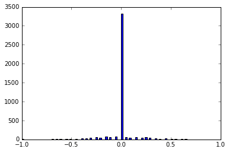
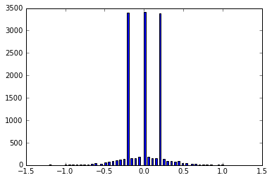

# Behavioral Cloning

This project, uses concepts of deep neural networks and convolutional neural networks to clone driving behavior. We will train, validate and test a model using Keras. The model will output a steering angle to an autonomous vehicle.

## Pipeline description

My pipeline consists of 6 Steps :</br>

1. [Creating Dataset](#creating-dataset)</br>
2. [Dataset Summary and Exploratory](#dataset-summary-and-exploratory)</br>
3. [Data Preprocessing](#data-preprocessing)</br>
4. [Model Architecture](#model-architecture)</br>
5. [Model Training and Solution Approach](#model-training-and-solution-approach)</br>
6. [Test Model](#test-model)</br>
</br>

---
### Creating Dataset

Please download [unity simulator](https://github.com/udacity/self-driving-car-sim). We will use this simulator to generate data to train our convolution neural network. This simulator records the data and writes them down to an CSV file 'driving_log.csv'.

We have to consider few strategies while collecting data , 
* The car should stay in the center of the road as much as possible
* if the car veers off to the side, it should recover back to center
* Driving counter-clockwise can help the model generalize
* collecting data from the second track can also help generalize the model

---
### Dataset Summary and Exploratory

The 'driving_log.csv' contains following data ,
* Left, Centre and Right Camera Image path
* Vehicle Speed
* Steering Angle
* Brake
* Throttle

The Dataset that we created consisted of 4215 samples considering only Centre camera.

On plotting the histogram as shown below we find that the distribution of data is skewed due to the track and the way simulator records data ,

<figure>
 
 <figcaption>
 <p></p> 
 </figcaption>
</figure>

To overcome this left & right camera images are used with angle correction and the final distribution of data looks like,

<figure>
 
 <figcaption>
 <p></p> 
 </figcaption>
</figure>


---
### Data Preprocessing

* **Normalization:**

Normalization is a process that changes the range of pixel intensity values. Usually the image data should be normalized so that the data has mean zero and equal variance.

In Keras, lambda layers can be used to create arbitrary functions that operate on each image as it passes through the layer.
In this project, a lambda layer is a convenient way to parallelize image normalization. The lambda layer will also ensure that the model will normalize input images when making predictions in drive.py.
That lambda layer could take each pixel in an image and run it through the formulas:

pixel_normalized = pixel / 255

pixel_mean_centered = pixel_normalized - 0.5

* **Cropping:**

The cameras in the simulator capture 160 pixel by 320 pixel images. Not all of these pixels contain useful information, however. In the image above, the top portion of the image captures trees and hills and sky, and the bottom portion of the image captures the hood of the car.Your model might train faster if you crop each image to focus on only the portion of the image that is useful for predicting a steering angle.

In Keras, the Cropping2D layer for image cropping within the model. This is relatively fast, because the model is parallelized on the GPU, so many images are cropped simultaneously. By contrast, image cropping outside the model on the CPU is relatively slow.
Also, by adding the cropping layer, the model will automatically crop the input images when making predictions in drive.py.

The Cropping2D layer might be useful for choosing an area of interest that excludes the sky and/or the hood of the car.

* **Flipping:**
A effective technique for helping with the left turn bias involves flipping images and taking the opposite sign of the steering measurement. The cv2 library also has similar functionality with the flip method.
We use this flipping technique in generator.

---
### Model Architecture

```python 
Layer (type)                 Output Shape              Param #   
=================================================================
lambda_4 (Lambda)            (None, 160, 320, 3)       0         
_________________________________________________________________
cropping2d_4 (Cropping2D)    (None, 90, 320, 3)        0         
_________________________________________________________________
conv2d_16 (Conv2D)           (None, 43, 158, 24)       1824      
_________________________________________________________________
conv2d_17 (Conv2D)           (None, 20, 77, 36)        21636     
_________________________________________________________________
conv2d_18 (Conv2D)           (None, 8, 37, 48)         43248     
_________________________________________________________________
conv2d_19 (Conv2D)           (None, 6, 35, 64)         27712     
_________________________________________________________________
conv2d_20 (Conv2D)           (None, 4, 33, 64)         36928     
_________________________________________________________________
flatten_4 (Flatten)          (None, 8448)              0         
_________________________________________________________________
dense_13 (Dense)             (None, 100)               844900    
_________________________________________________________________
dense_14 (Dense)             (None, 50)                5050      
_________________________________________________________________
dense_15 (Dense)             (None, 10)                510       
_________________________________________________________________
dense_16 (Dense)             (None, 1)                 11        
=================================================================
Total params: 981,819
Trainable params: 981,819
Non-trainable params: 0
_________________________________________________________________
```
---
### Model Training and Solution Approach

The Dataset obtained is split into training and validation set using,

```python
train_samples, validation_samples = train_test_split(samples, test_size=0.2)
```

Initially LeNet model with three epochs and the training data with some pre-processing such as,Lambda layer to normalize the input images to zero means and Cropping layer. The model trained failed at the curve with no lane marks and ran into mud.

Later more powerfull model: nVidia model The only modification was to add a new layer at the end to have a single output and also Augmented the data by adding the same image flipped with a negative angle. Apparently after 3 Epoch it seems to suffice the requirement of car not leaving the lane and completing the track.

The following are some commong model training parameters used,
* Optimizer: Adam Optimizer , so the learning rate was not tuned manually.
* No. of epochs: 3
* Images generated per epoch: 10116 images generated
* Validation Set: 2529 images, generated on the fly
* Keras' `fit_generator` method is used to train/Validation images generated by the generator

---
### Test Model

To run the simulator in Autonomous mode using model run the following command,

```python
python drive.py model.h5 output
```

The above command will load the trained model and use the model to make predictions on individual images in real-time and send the predicted angle back to the server via a websocket connection.

The fourth argument, run1, is the directory in which to save the images seen by the agent. If the directory already exists, it'll be overwritten.

The image file name is a timestamp of when the image was seen. This information is used by video.py to create a chronological video of the agent driving.

```python
python video.py output
```

The above command creates a video based on images found in the output directory. The name of the video will be the name of the directory followed by '.mp4', so, in this case the video will be [output.mp4](./Output.mp4).

Please keep in mind that training images are loaded in BGR colorspace using cv2 while drive.py load images in RGB to predict the steering angles.
